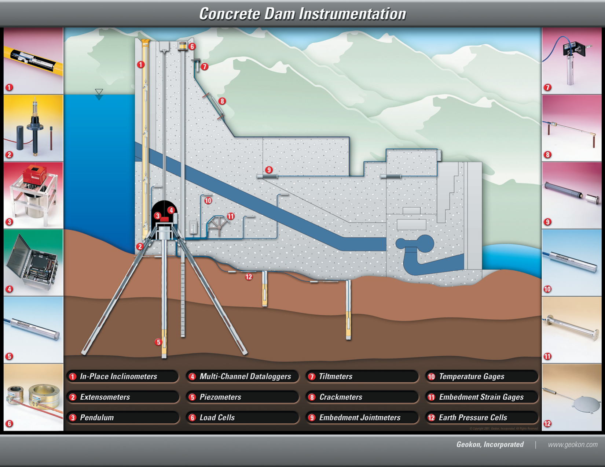

# Dam Monitoring

## Objective

Detect seepage changes, internal erosion, and deformation in embankment / concrete dams to prevent catastrophic failure.

## Concrete Dam Instrumentation Schematic

*Source: [GEO-Instruments — Concrete Dam Schematic](https://www.geoinstruments.ca/en/downloads/) (free, public).*

## Typical instrument array

| Instrument | Purpose |
| --- | --- |
| Multi-level piezometers | Profile pore pressure through the embankment |
| Seepage weirs / V-notch | Quantify downstream seepage flow |
| Extensometers / probe inclinometers | Detect internal movement |
| Pendulums (concrete dams) | Measure top deflection relative to foundation |
| Joint meters / crackmeters | Track crack / joint opening across construction joints |
| RSTAR Affinity mesh | Aggregates long cross-dam sensor arrays |

## Methodology reference

- Dunnicliff Chapter 11 (piezometers)
- Dunnicliff Chapter 12 (extensometers)
- FERC / USBR monitoring guidelines (referenced from FHWA manual)
- GEO-Instruments case studies — *Structural Health Monitoring of a Concrete Arch Dam* + *Toulnustouc CFRD Instrumentation Overview* ([whitepapers →](https://www.geoinstruments.ca/en/downloads/))

## Related

- [RST Piezometers](../rst-instruments/piezometers.md)
- Earth dam variant — see [Earth Dam Instrumentation](../assets/schematic-earth-dam.png)
