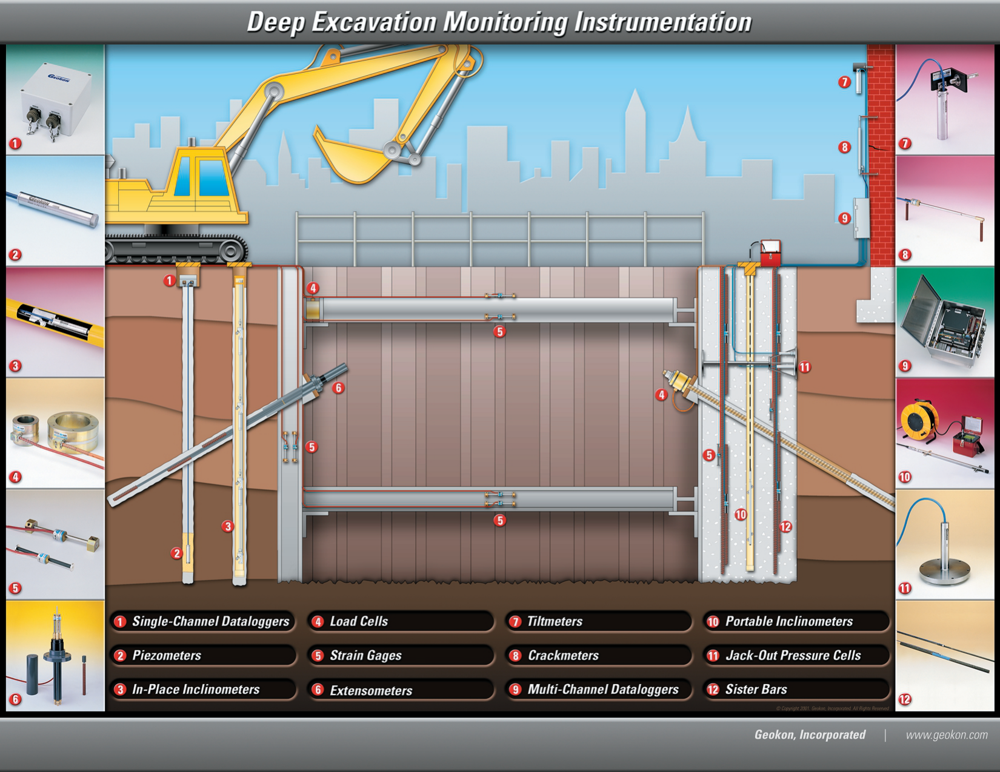

# Foundation & Deep Excavation Monitoring

## Objective

Verify design assumptions about load-settlement behavior, validate deep foundation capacity, and protect adjacent structures during deep excavation (heave, lateral movement).

## Deep Excavation Instrumentation Schematic

*Source: [GEO-Instruments — Deep Excavation Schematic](https://www.geoinstruments.ca/en/downloads/) (free, public).*

## Typical instrument array

| Instrument | Purpose |
| --- | --- |
| Load cells | Pile load tests, anchor load monitoring |
| Settlement plates / rod extensometers | Track consolidation under load |
| Inclinometers (perimeter) | Lateral movement of excavation support walls |
| Piezometers | Dewatering pressures inside and outside excavation |
| Tiltmeters / AMTS | Monitor adjacent buildings for tilt / settlement trough |

## Methodology reference

- Das — Principles of Foundation Engineering (load tests, pile instrumentation)
- Dunnicliff Chapter 12 (extensometers)
- GEO-Instruments' reference AMTS deployment at SeaTac airport ([case study →](https://www.geo-instruments.com/))

## Related

- [RST Extensometers](../rst-instruments/extensometers.md)
- [RST Inclinometers](../rst-instruments/inclinometers.md)
