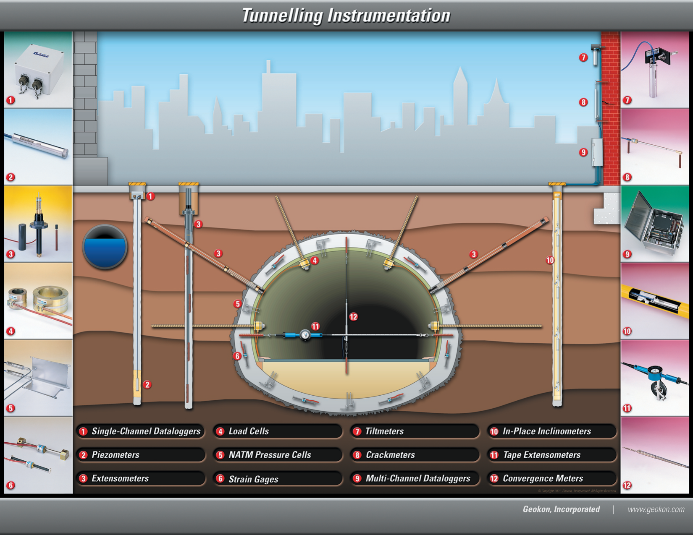

# Tunnel Instrumentation

## Objective

Monitor ground movement around tunnel excavation, convergence of linings, and pore-pressure changes during construction — protecting both the tunnel cross-section and adjacent structures above.

## Tunnelling Instrumentation Schematic

*Source: [GEO-Instruments — Tunnelling Schematic](https://www.geoinstruments.ca/en/downloads/) (free, public).*

## Typical instrument array

| Instrument | Purpose |
| --- | --- |
| Convergence arrays / tape extensometers | Monitor tunnel cross-section closure |
| Inclinometers (above alignment) | Detect surface settlement trough |
| Piezometers | Dewatering pressures near the tunnel face |
| Extensometers | Rock-mass displacement above the crown |
| Pressure cells (NATM) | Ground pressure on tunnel lining |
- RSTAR mesh radio can bring tunnel-array data up to surface gateways

## Methodology reference

- Dunnicliff Chapter 9 (inclinometers)
- Dunnicliff Chapter 13 (tape extensometers / convergence monitoring)
- GEO-Instruments — *Practical Consideration to Implement an Instrumentation Program* (Tsankov Kamak Dam) ([whitepaper →](https://www.geoinstruments.ca/en/downloads/))
