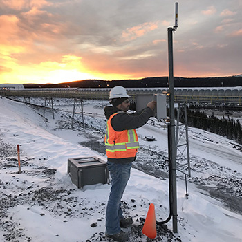
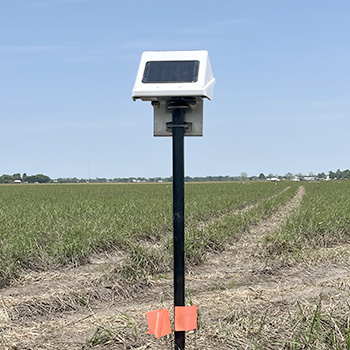
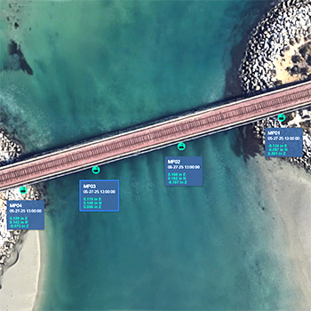
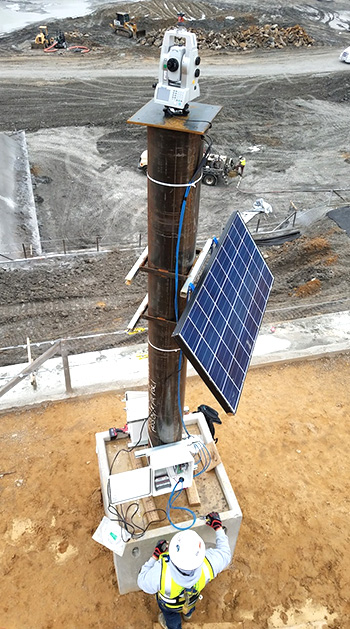

# GEO-Instruments

GEO-Instruments focuses on **large-scale infrastructure projects**, providing:

- Satellite loggers (EWS series)
- Locator One GNSS sensors
- Wide-area monitoring for tailings dams
- Automated Total Stations (AMTS) for excavation and structural monitoring
- ElastiSense displacement sensors

## Selected field installations

Wireless data logger deployment on an iron-ore mine tailings dam (large-area wireless mesh):

GNSS sensors monitoring pier settlement under load (Locator One):

Apollo Planview — bridge fitted with GNSS sensors for long-term deformation tracking:

AMTS tower at an excavation site:

## Resources

- Corporate site: [geo-instruments.com](https://www.geo-instruments.com/)
- Downloads archive (datasheets, white papers, schematics): [geoinstruments.ca/en/downloads/](https://www.geoinstruments.ca/en/downloads/)
- Cited in the *Mining Glossary* reference PDF as a tailings monitoring reference.
